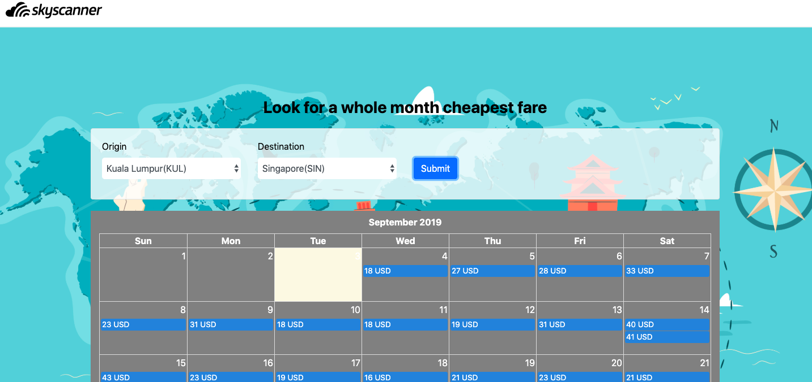

<p align="center">
  <a href="https://angular.io/">
    
  </a>

  <h3 align="center">Topdanmark Test</h3>

  <p align="center">
    Skyscanner app with Angular 8 + Angular CLI + Rapid API
    <br>
      
  </p>
</p>

## Quick start

**WARNING**

> Verify that you are running node 12.8.1 by running node -v in a terminal/console window. Older versions may produce errors, but newer versions are fine.

 ```bash
 npm i
 npm start

Tasks                       | Description
----------------------------|---------------------------------------------------------------------------------------
npm start                   | Start the app in development mode
npm build                   | Build the app for production
npm build-aot               | Build the app for production in aot mode
npm run test                | Run all unit tests with karma and jasmine

## Development server

Run `ng serve` for a dev server. Navigate to `http://localhost:4200/`. The app will automatically reload if you change any of the source files.

## Code scaffolding

Run `ng generate component component-name` to generate a new component. You can also use `ng generate directive|pipe|service|class|guard|interface|enum|module`.


## Running unit tests

Run `ng test` to execute the unit tests via [Karma](https://karma-runner.github.io).

## Running end-to-end tests

Run `ng e2e` to execute the end-to-end tests via [Protractor](http://www.protractortest.org/).

## Further help

To get more help on the Angular CLI use `ng help` or go check out the [Angular CLI README](https://github.com/angular/angular-cli/blob/master/README.md).
